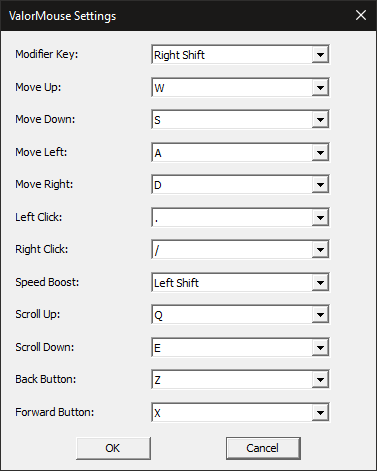

# ValorMouse - Keyboard Mouse Emulator

ValorMouse is a lightweight Windows utility that lets you control your mouse cursor and clicks using keyboard shortcuts. Perfect for situations where taking your hands off the keyboard isn't an option.

## Features

- **Keyboard-controlled cursor movement** (WASD-style)
- **Mouse click emulation** (left, right, and side buttons)
- **Mouse wheel emulation**
- **Adjustable speed** with acceleration and boost
- **Fully customizable key bindings**
- **System tray integration** for easy access
- **Auto-start option** for convenience

## Installation

1. Download the latest release from the [Releases page](#)
2. Run `ValorMouse.exe`
3. Right-click the tray icon to configure

## Building from Source

### Requirements
- Windows 10/11
- Visual Studio 2022 (or compatible compiler)

### Steps
1. Clone the repository
2. Open the solution in Visual Studio
3. Build the project

## How It Works

ValorMouse uses low-level keyboard hooks to intercept key presses when the modifier key is held down. The mouse movement is simulated with acceleration for precise control, and all mouse buttons/clicks are emulated through Windows input APIs.

## Troubleshooting
- **Keys not working**: Check for conflicts with other applications or try running as Administrator
- **Cursor jumps**: Adjust the speed in the code (modify `MOUSE_BASE_SPEED` and `MAX_SPEED` values)

